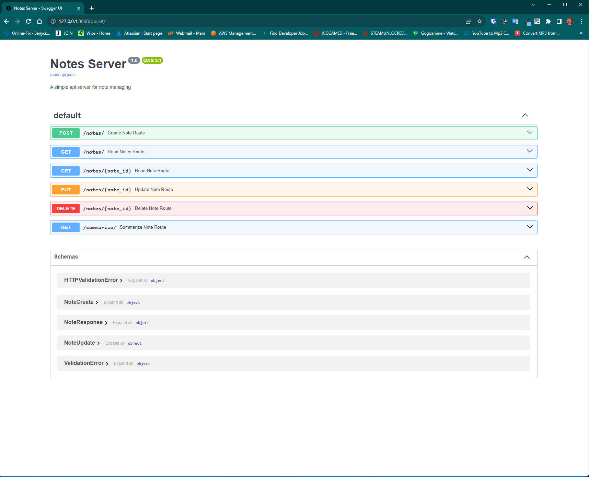
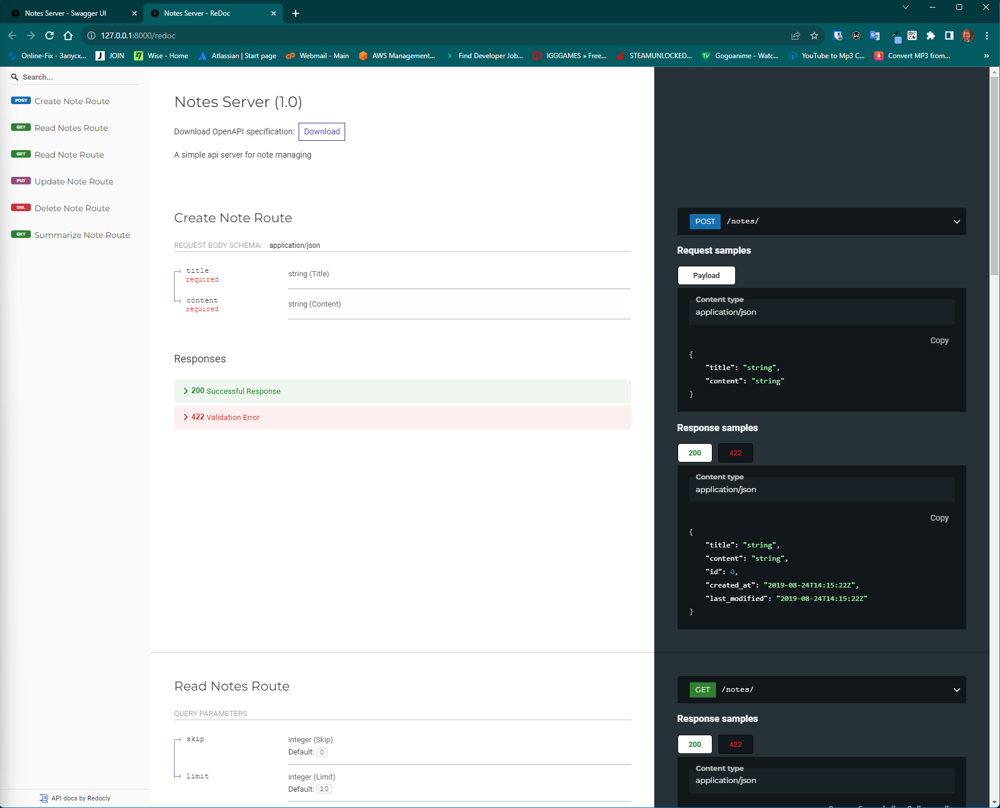

# FastAPI Note-Taking Project

Welcome to the FastAPI Note-Taking project! This project provides a simple API server for managing notes using FastAPI, OpenAI, and Langchain.

## Installation
```bash
pip install -r requirements.txt
```


### Prerequisites

- Python 3.10+
- PostgreSQL 16 database server
- OpenAi Account

### Configure Database Connection
- Create a .env file in the root of your project.
- Add the following database connection details to the .env file:
  - DB_HOST=localhost
  - DB_USER=your_database_user
  - DB_PASS=your_database_password
  - DB_NAME=your_database_name
  - OPENAI_API_KEY=your_opeenAi_key
- Save the file.
- You will need to start postgres server for the database connection to be successful
- ```bash 
  net start postgresql-x64-16
  ```
- To check your firewall settings, you can use the command:
- ```bash 
  netsh advfirewall firewall show rule name="PostgreSQL"
  ```
- If you don't see any rules then you can use the following command to allow postgres through firewall:
- ```bash 
  netsh advfirewall firewall add rule name="PostgreSQL" dir=in action=allow protocol=TCP localport=5432
  ```
  

### Running the Application
```bash
uvicorn app.api.main:app --reload
```
The API will be accessible at http://127.0.0.1:8000.

### OpenAPI (Swagger) Documentation
The FastAPI project automatically generates OpenAPI (Swagger) documentation for your API.

Visit http://127.0.0.1:8000/docs or http://127.0.0.1:8000/redoc to explore the API documentation interactively.

#### Usage
- Create a new note: Send a POST request to http://127.0.0.1:8000/notes/ with the required payload.
- Read a note: Send a GET request to http://127.0.0.1:8000/notes/{note_id}/.
- Update a note: Send a PUT request to http://127.0.0.1:8000/notes/{note_id}/ with the updated payload.
- Delete a note: Send a DELETE request to http://127.0.0.1:8000/notes/{note_id}/.




### Summarization with OpenAI & LangChain
To use the summarization feature, make a GET request to http://127.0.0.1:8000/summarize/?note_id={note_id}.

#### Steps
- Create OpenAi account and generate key using this link https://platform.openai.com/account/api-keys
- Ensure that you have set the OpenAI API key in your environment variable named OPENAI_API_KEY and add it to the .env file
- Add Template for LangChain and GPT to make the chatGpt customized for a specific task in our case is to summarize notes given to him
- Add Human Template which is the content of the note that the user will enter
- Pass both to langchain and create a chain from them
- Finally take the user input (note) and pass it in the Human Template and then langchain and gpt will summarize the note for you and return the summarized content for this specific note

## ***<div align="center">I'm Mohamed Halfawy, a full-time full-stack developer 👨‍💻 working remotely since 2019🚀</div>***

# 💫 About Me:

###### *<div align="center">I’m a full-stack developer. Being a full-stack allows me to not only develop client-facing apps and websites but also develop them with cutting-edge backend support. I specialize in building robust backends that do all the heavy lifting for your app or website. I love designing systems that are light yet powerful, distributed yet synchronized, and beautiful yet effective. I also frequently blog about the world behind the screen which involves system designs, databases, security, servers, optimization, and also promising technologies like Blockchain and PWAs.</div>*

- 🔭 I’m currently working on [Uktob Notes Application](https://github.com/mohamedelhalfawyy/Zoe_Frontend)


- 🌱 I’m currently learning FastAPI & GCP


- ❓ Ask me about anything related to MERN stack and related technologies


- 👨‍💻 All of my projects are available at https://mohamedelhalfawyy.github.io/Halfawy_Portfolio/


- 📄 Know about my experiences https://mohamedelhalfawyy.github.io/Halfawy_Portfolio/


- 📫 How to reach me mohamed.elhalfawyy@gmail.com


- ⚡ Fun fact: I use tabs over spaces & i watch anime 😉


<br/>  


## My Skill Set
<table><tr><td valign="top" width="33%">


### Frontend
<div align="center">  
<a href="https://reactjs.org/" target="_blank"></a>  
<a href="https://getbootstrap.com/docs/3.4/javascript/" target="_blank"></a>
<a href="https://angular.io/" target="_blank"></a>  
<a href="https://www.windicss.org/" target="_blank"></a>
<a href="https://en.wikipedia.org/wiki/HTML5" target="_blank"></a>  
<a href="https://www.w3schools.com/css/" target="_blank"></a>
<a href="https://mui.com/" target="_blank"></a>  
<a href="https://www.tailwindcss.com/" target="_blank"></a>  
<a href="https://wordpress.com/" target="_blank"></a>
<a href="https://flutter.dev/" target="_blank"></a>
<a href="https://www.figma.com/" target="_blank"></a>
</div>

</td><td valign="top" width="33%">


### Backend
<div align="center">  
<a href="https://www.java.com/" target="_blank"></a>
<a href="https://www.javascript.com/" target="_blank"></a>  
<a href="https://nodejs.org/" target="_blank"></a>
<a href="https://expressjs.com/" target="_blank"></a>
<a href="https://www.jestjs.io/" target="_blank"></a>
<a href="https://www.python.org/" target="_blank"></a>
<a href="https://www.djangoproject.com/" target="_blank"></a>
<a href="https://flask.palletsprojects.com/" target="_blank"></a>
<a href="https://pandas.pydata.org/" target="_blank"></a>
<a href="https://numpy.org/" target="_blank"></a>
<a href="https://www.php.net/" target="_blank"></a>
<a href="https://dart.dev/" target="_blank"></a>
<a href="https://www.android.com/intl/en_in/" target="_blank"></a>
<a href="https://www.mongodb.com/" target="_blank"></a>  
<a href="https://www.mysql.com/" target="_blank"></a>   
<a href="https://www.sqlite.org/index.html" target="_blank"></a>   
<a href="https://www.microsoft.com/en-us/sql-server" target="_blank"></a>   
<a href="https://www.oracle.com/in/index.html" target="_blank"></a>
<a href="https://firebase.google.com/" target="_blank"></a>
<a href="https://www.apachefriends.org/" target="_blank"></a>
<a href="https://www.linux.org/" target="_blank"></a>  
<a href="https://www.gnu.org/software/bash/" target="_blank"></a>
<a href="https://docs.microsoft.com/en-us/powershell/" target="_blank"></a>
<a href="https://jwt.io/" target="_blank"></a>
<a href="https://www.json.org/json-en.html" target="_blank"></a>
<a href="https://graphql.org/" target="_blank"></a>
<a href="https://www.npmjs.com/" target="_blank"></a>
<a href="https://jquery.com/" target="_blank"></a>
</div>

</td><td valign="top" width="33%">


### DevOps
<div align="center">  
<a href="https://aws.amazon.com/" target="_blank"></a>  
<a href="https://cloud.google.com/" target="_blank"></a>  
<a href="https://www.linux.org/" target="_blank"></a>  
<a href="https://github.com/" target="_blank"></a>  
<a href="https://about.gitlab.com/" target="_blank"></a>
<a href="https://www.heroku.com/" target="_blank"></a>  
<a href="https://www.docker.com/" target="_blank"></a>  
<a href="https://kubernetes.io/" target="_blank"></a>  
<a href="https://www.tensorflow.org/" target="_blank"></a>  
<a href="https://www.atlassian.com/software/jira" target="_blank"></a>  
<a href="https://gradle.org/" target="_blank"></a>  
<a href="https://www.postman.com/" target="_blank"></a>  
</div>

</td></tr></table>  

<br/>  


## Connect with me
<div align="center">
<a href="https://linkedin.com/in/mohamedelhalfawy" target="_blank">

</a>
<a href="https://github.com/mohamedelhalfawyy" target="_blank">

</a>
<a href="https://gitlab.com/mohamedelhalfawy" target="_blank">

</a>  
</div>  


<br/>  


## Github Stats
<br/>
<br/>

<br/>

## 🏆 GitHub Trophies


### ✍️ Random Dev Quote


<br/>  

<div align="center">

</div>  


<br/>  

<div align="center">
            <a href="https://paypal.me/Halfawyy" target="_blank" style="display: inline-block;">
                
            </a></div>
<br />
